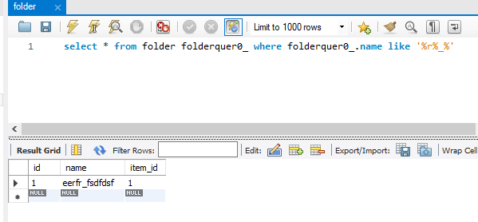

# Criteria

preconditional:
- add new schema: `db_example` to mysql

after run application, please run:

```sql
INSERT INTO `db_example`.`item` (`id`, `item_description`, `item_name`, `item_price`) VALUES ('1', 'item1', 'item1', '8890');
INSERT INTO `db_example`.`item` (`id`, `item_description`, `item_name`, `item_price`) VALUES ('2', 'item2', 'item2', '99');
INSERT INTO `db_example`.`item` (`id`, `item_description`, `item_name`, `item_price`) VALUES ('3', 'item3', 'item3', '100');
INSERT INTO `db_example`.`item` (`id`, `item_description`, `item_name`, `item_price`) VALUES ('4', 'item4', 'item4', '101');

INSERT INTO `` (`id`,`field`,`field_type`,`value`,`item_id`) VALUES (1,'sdf',0,'344',1);
INSERT INTO `` (`id`,`field`,`field_type`,`value`,`item_id`) VALUES (2,'test',1,'34',3);

INSERT INTO `db_example`.`many` (`id`, `name`, `one_id`) VALUES ('1', 'VN', '1');
INSERT INTO `db_example`.`many` (`id`, `name`, `one_id`) VALUES ('2', 'VN1', '2');


```


## FIELD TYPE
    EQUAL:0
    GREATER_THAN: 1
    LESS_THAN: 2
    LIKE: 3
    ORDER_BY: 4
    GROUP_BY: 5

request on postman
```text
// request: sql select * from item where id=2 and item_price=8890**

GET http://localhost:8080/item/custom
Content-Type: application/json

[
  {
    "field": "id",
    "value": "2"
  },
    {
    "field": "itemPrice",
    "value": "8890"
  }
]

// request: sql select * from item where id=1 and item_price=8890**

GET http://localhost:8080/item/custom
Content-Type: application/json

[
  {
    "field": "id",
    "value": "1"
  },
    {
    "field": "itemPrice",
    "value": "8890"
  }
]

// request: sql select * from item where item_price > 100 and item_name like "%tes%"

GET http://localhost:8080/item/custom
Content-Type: application/json

[
  {
    "field": "itemPrice",
    "value": "100",
    "fieldType": 1 // GREATER_THAN
  },
  {
    "field": "itemName",
    "value": "tes",
    "fieldType": 3 // LIKE
  }
]

// request: sql select * from item where item_name like "%tes%" order by item_price DESC

GET http://localhost:8080/item/custom
Content-Type: application/json


[
  {
    "field": "itemPrice",
    "value": "desc",
    "fieldType": 4 // ORDER_BY
  },
  {
    "field": "itemName",
    "value": "tes",
    "fieldType": 3 // LIKE
  }
]

// select *, count(id) from item it where item_name like "%tes%" group by item_price

[
  {
    "field": "itemPrice",
    "value": "1",
    "fieldType": 5 // GROUP_BY
  },
  {
    "field": "itemName",
    "value": "%tes%",
    "fieldType": 3 // LIKE
  }
]

// select * from item it order by id DESC
// get page 0 with 2 elements
GET http://localhost:8080/page?page=0&size=2&sort="id",DESC


@OneToOne
curl --location --request GET 'http://localhost:8080/folder/test'

@OneToMany
curl --location --request GET 'http://localhost:8080/oneToMany/get'

curl --location --request GET 'http://localhost:8080/folder/custom' \
--header 'Content-Type: application/json' \
--data-raw '[
    {
        "field": "id",
        "value": "1",
        "fieldType": 0 // EQUAL
    },
    {
        "field": "itemPrice",
        "value": "8890",
        "fieldType": 2 // LESS_THAN
    }
]''

@ManyToMany
curl --location --request GET 'http://localhost:8080/oneToMany/get3'

```


## Properties:

    Root: is domain (table name) from Item
    CriteriaQuery: is return object (select * or select item)
    CriteriaBuilder: suppor to build query

[Reference link](https://topdev.vn/blog/hibernate-criteria-query-language-hcql/)


# Specifications

    curl --location 'http://localhost:8080/get'

    curl --location 'http://localhost:8080/subquery'


# How to escape a specification characters in java

    GET http://localhost:8080/folder

we will find and add 2 '%' in before and after that character.

    String name = '%' + "r_".replace("_", "%_%") + '%';
    
    select * from folder folderquer0_ where folderquer0_.name like name


