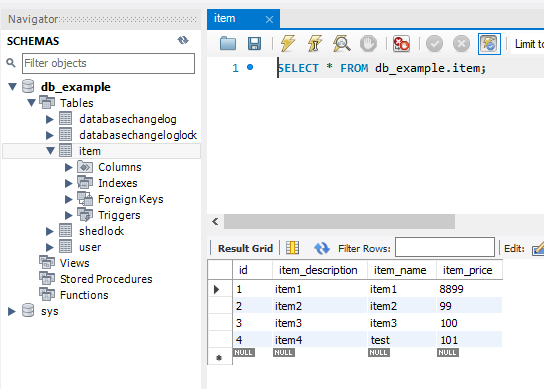
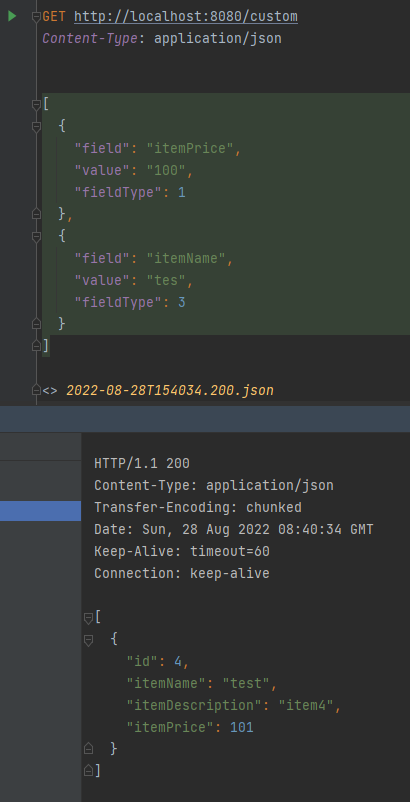

# Criteria

preconditional:
- add new schema: `db_example` to mysql

after run application, please run:

```sql
INSERT INTO `db_example`.`item` (`id`, `item_description`, `item_name`, `item_price`) VALUES ('1', 'item1', 'item1', '8890');
INSERT INTO `db_example`.`item` (`id`, `item_description`, `item_name`, `item_price`) VALUES ('2', 'item2', 'item2', '99');
INSERT INTO `db_example`.`item` (`id`, `item_description`, `item_name`, `item_price`) VALUES ('3', 'item3', 'item3', '100');
INSERT INTO `db_example`.`item` (`id`, `item_description`, `item_name`, `item_price`) VALUES ('4', 'item4', 'item4', '101');

```


request on postman
```text
// request: sql select * from item where id=2 and item_price=8890**

GET http://localhost:8080/custom
Content-Type: application/json

[
  {
    "field": "id",
    "value": "2"
  },
    {
    "field": "itemPrice",
    "value": "8890"
  }
]

// request: sql select * from item where id=1 and item_price=8890**

GET http://localhost:8080/custom
Content-Type: application/json

[
  {
    "field": "id",
    "value": "1"
  },
    {
    "field": "itemPrice",
    "value": "8890"
  }
]

// request: sql select * from item where item_price > 100 and item_name like "%tes%"

GET http://localhost:8080/custom
Content-Type: application/json

[
  {
    "field": "itemPrice",
    "value": "100",
    "fieldType": 1
  },
  {
    "field": "itemName",
    "value": "tes",
    "fieldType": 3
  }
]

// request: sql select * from item where item_name like "%tes%" order by item_price DESC

GET http://localhost:8080/custom
Content-Type: application/json


[
  {
    "field": "itemPrice",
    "value": "desc",
    "fieldType": 4
  },
  {
    "field": "itemName",
    "value": "tes",
    "fieldType": 3
  }
]

// select *, count(id) from item it where item_name like "%tes%" group by item_price

[
  {
    "field": "itemPrice",
    "value": "1",
    "fieldType": 5
  },
  {
    "field": "itemName",
    "value": "%tes%",
    "fieldType": 3
  }
]

// select * from item it order by id DESC
// get page 0 with 2 elements
GET http://localhost:8080/page?page=0&size=2&sort="id",DESC

```


## Properties:

    Root: is domain (table name) from Item
    CriteriaQuery: is return object (select * or select item)
    CriteriaBuilder: suppor to build query

[Reference link](https://topdev.vn/blog/hibernate-criteria-query-language-hcql/)

